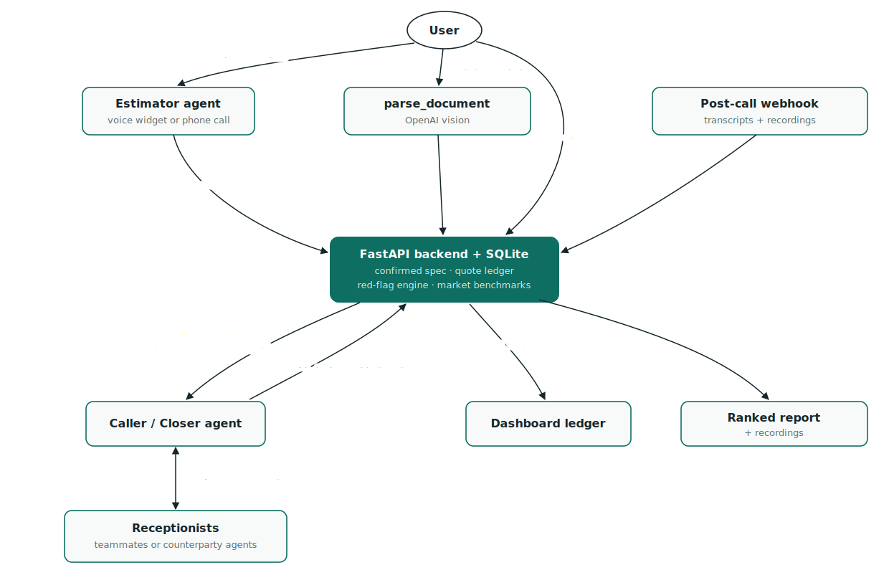

# ScanSaver — The Negotiator for medical imaging

## Full Video Drive Link: https://drive.google.com/file/d/1o8rt4lEMDfvs8hMQe9Caji4QGlYFnEoc/view?usp=sharing

An MRI in the same city runs anywhere from $400 to $4,000 for the same scan on
the same machine. ScanSaver interviews you once, phones the imaging centers,
extracts real itemized cash prices, negotiates using your best competing quote,
and hands you a ranked report with transcripts and recordings as evidence.

Built on **ElevenLabs Agents** (voice, with Claude as the hosted agent brain) +
**OpenAI** (document parsing, report writing) + **FastAPI/SQLite** (glue) for
the Hack-Nation "The Negotiator" challenge.

## Quickstart

On Windows, after creating `.venv`, start the local backend with:

```powershell
.\start.cmd
```

```bash
python -m venv .venv && source .venv/bin/activate
pip install -r requirements.txt
cp .env.example .env   # fill in keys

# local backend + dashboard
uvicorn backend.main:app --reload --port 8000

# provision all five agents (estimator, caller, 3 counterparties)
python -m scripts.setup_agents

# after intake + confirming a spec at http://localhost:8000 :
python -m scripts.start_call --to +1XXXXXXXXXX --facility "Summit Imaging Center"
python -m scripts.start_call --to +1XXXXXXXXXX --facility "Premier Diagnostic Imaging" --negotiate
```

The backend and dashboard do not require a tunnel. Cloud-hosted ElevenLabs
agents cannot reach `localhost`, so live server-tool and post-call webhook
callbacks still require setting `PUBLIC_BASE_URL` to a reachable HTTPS URL.
That URL can come from any tunneling or deployment provider; ngrok is optional.

One-time dashboard steps on elevenlabs.io: import a Twilio number (→
`ELEVENLABS_PHONE_NUMBER_ID`), configure the workspace post-call webhook at
`<PUBLIC_BASE_URL>/webhooks/post_call` when using a public URL, and allow the
Estimator agent's public web widget.

## How the agents wire together

The five ElevenLabs agents never talk to each other directly — all orchestration
runs through our FastAPI backend (that's deliberate: the spec, the leverage, and
the evidence chain stay under our control).



## Repo tour

```
config/            vertical configs — swap file = swap vertical (see moving.example.json)
agents/            prompt templates (<<build-time>> + {{runtime}} tokens)
agents/counterparties/  the simulated market: stonewaller / lowballer / upseller
backend/           FastAPI app, SQLite, red-flag engine, report generator
scripts/           provision agents, launch calls
frontend/          single-file dashboard (intake → confirm → ledger → report)
CLAUDE.md          the real manual — architecture, verify-with-docs list, milestones
```

**Working on this with Claude Code? Start by reading `CLAUDE.md`** — it contains
the docs-verification checklist that must run before the first live call, and
the milestone order.
